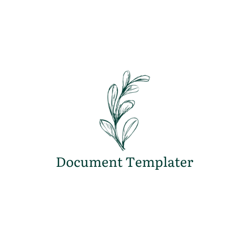

<p align="center">
  <a href="https://github.com/m4nd0mb3/document-templater" target="_blank">
    
  </a>
</p>

<p align="center">
<a href="https://github.com/m4nd0mb3/document-templater/releases">
    
  </a>
  <a href="https://github.com/m4nd0mb3/document-templater/releases">
    
  </a>
  <a href="https://github.com/m4nd0mb3/document-templater/blob/master/LICENSE">
    
  </a><br/>
  <a href='https://document-templater.readthedocs.io/en/latest/?badge=latest'>
    
  </a>   
  <a href="https://github.com/m4nd0mb3/document-templater/issues">
    
  </a>
  <a href="https://github.com/m4nd0mb3">
    
  </a>
  <a href="https://github.com/carboneio/carbone">
    
  </a>
</p>

<p><b>🤖 Document Templater</b> - Template Based Document Generation Microservice</p>

Document Templater is a powerful and flexible microservice designed to simplify the generation of complex, personalised documents from predefined templates. Combining ease of use with the ability to create highly personalised documents, this microservice is ideal for automating the process of generating reports, contracts, forms and more.

## Table of content

README idiomas: :angola: [Português](./locales/pt/README.md), :us: [English](README.md)


- [How It Works](#how-it-works)
- [Getting Started](#getting-started)
    - [Prerequisites](#prerequisites)
- [Swagger](#swagger)
- [Configuration](#configuration)
- [Contributing](#contributing)
- [License](#license)


## How It Works

Document Templater leverages the Carbone library to merge templates with data, producing the desired output documents. It utilizes Node.js and Express.js for the backend, allowing you to build a robust and customizable document generation service.

The core features of Document Templater include:

- 📝 Generate professional, elegant documents from pre-loaded templates.
- 🎨 Easily customise documents by incorporating specific data.
- 🌈 Support for multiple template formats, including Word (docx) and PDF.
- 🍏 Simple integration with external APIs to fetch data in real time.
- ⭐️ Flexible settings to adjust the appearance and content of documents.
- 📐 Intuitive API that allows seamless integration into your existing projects.


Document Templater offers a scalable and efficient solution to meet your document generation needs, saving you time and ensuring consistent, high-quality results.

Bring document generation to life easily and reliably with Document Templater.

## Getting Started

Follow these steps to get started with Document Templater:

### Prerequisites

- Node.js: Make sure you have Node.js installed on your machine.
- LibreOffice: Make sure you have LibreOffice version 7.5.1.1 installed on your machine. 

### Installation

1. Clone the repository:

   ```sh
   git clone https://github.com/m4nd0mb3/document-templater.git
   ```

2. Navigate to the project directory:

   ```sh
   cd document-templater
   ```

3. Install dependencies:

   ```sh
   npm install
   ```

### Usage

1. Start the server:

   ```sh
   npm start
   ```

2. Open your web browser and navigate to [http://localhost:3000](http://localhost:3000).

3. Explore the provided endpoints and examples to see how to generate different types of documents.

### Running with Docker

To run Document Templater using Docker, follow these steps:

1. Build the Docker image:

   ```sh
   docker build -t document-templater:latest .
   ```

2. Run the Docker container:

   ```sh
   docker run -p 3000:3000 -d document-templater:latest
   ```

3. Open your web browser and navigate to [http://localhost:3000](http://localhost:3000).


## Swagger

Document Templater introduces a seamless integration with Swagger, enhancing your experience with the document generation service! 📄✨

With Swagger, accessing the powerful set of Document Templater's basic endpoints has never been easier. Whether you're a developer or just getting started, you'll appreciate the simplicity and efficiency it brings to interacting with the document generation service.

Here's a glimpse of how you can utilize Swagger to interact with Document Templater's endpoints:

1. **Explore Documentation:** Dive into the comprehensive documentation provided by Swagger to understand the available endpoints and their functionalities.

2. **Try It Out:** Use the user-friendly interface to experiment with various parameters and see real-time responses, enabling you to fine-tune your requests.

3. **Generate Documents:** Leverage the endpoints to effortlessly create and manage your documents, all within a single, unified platform.

To get started, simply access the Document Templater Swagger documentation via the following endpoint:


**Endpoint:** `/api-docs/`


---


### Configuration

Modify the configuration in `.env` to customize settings such as port, file paths, and more.

## Contributing

Contributions are welcome! If you encounter issues or want to add new features, feel free to submit a pull request.

## License

This project is licensed under the [Apache-2.0 License](LICENSE).

---
